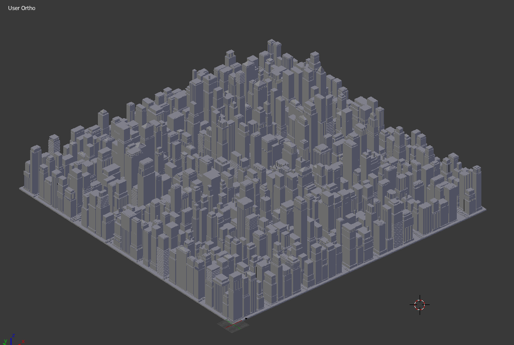
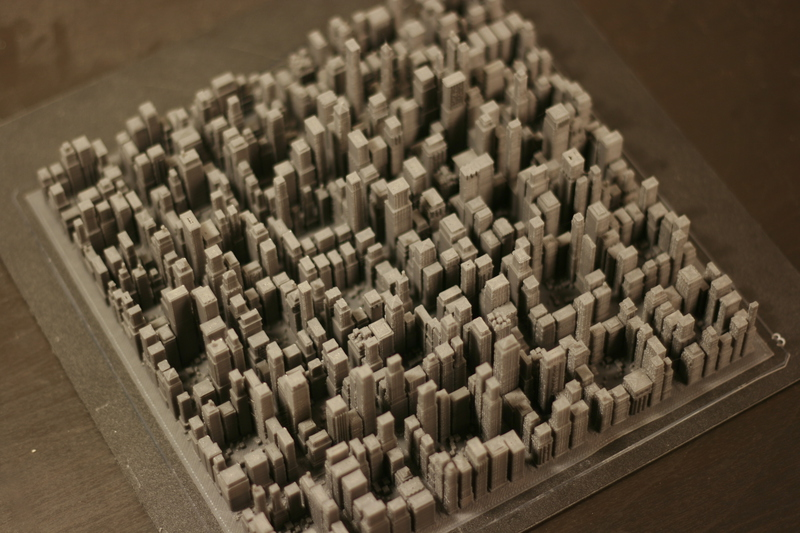
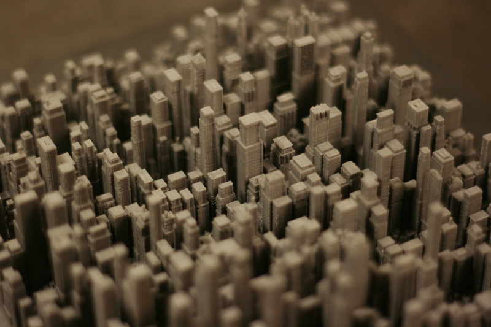
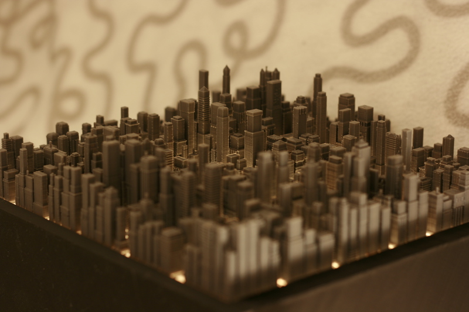
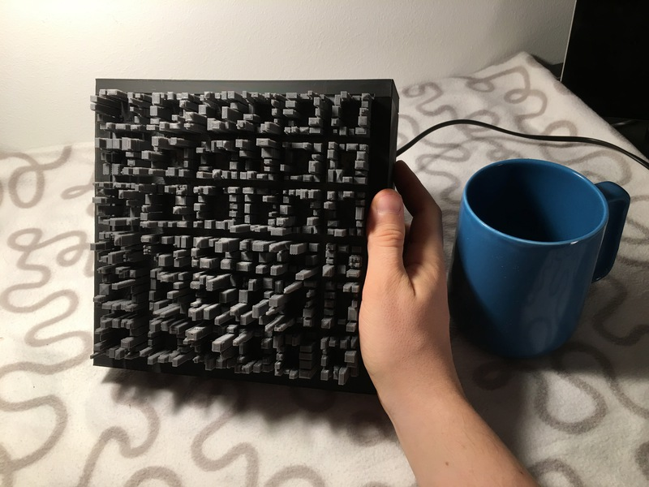

# citygen3d

This is a script that randomly generates mesh of a 3D cityscape. I used this as a part of the design for my 3D-printed night lamp. A video on the process can be found here:

https://www.youtube.com/watch?v=LJn6Ra-mMB0

Below you will find some images of the 3D model:

